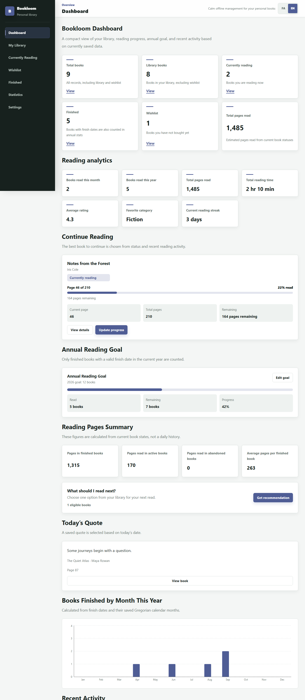
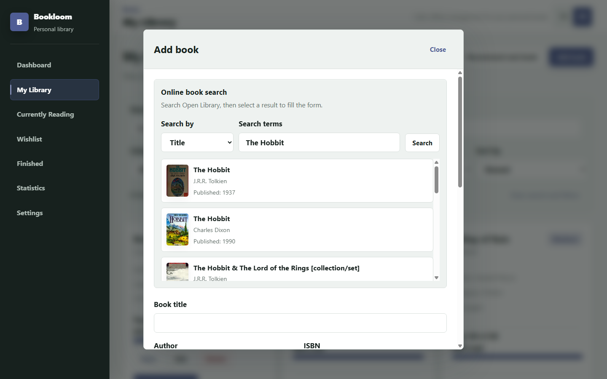
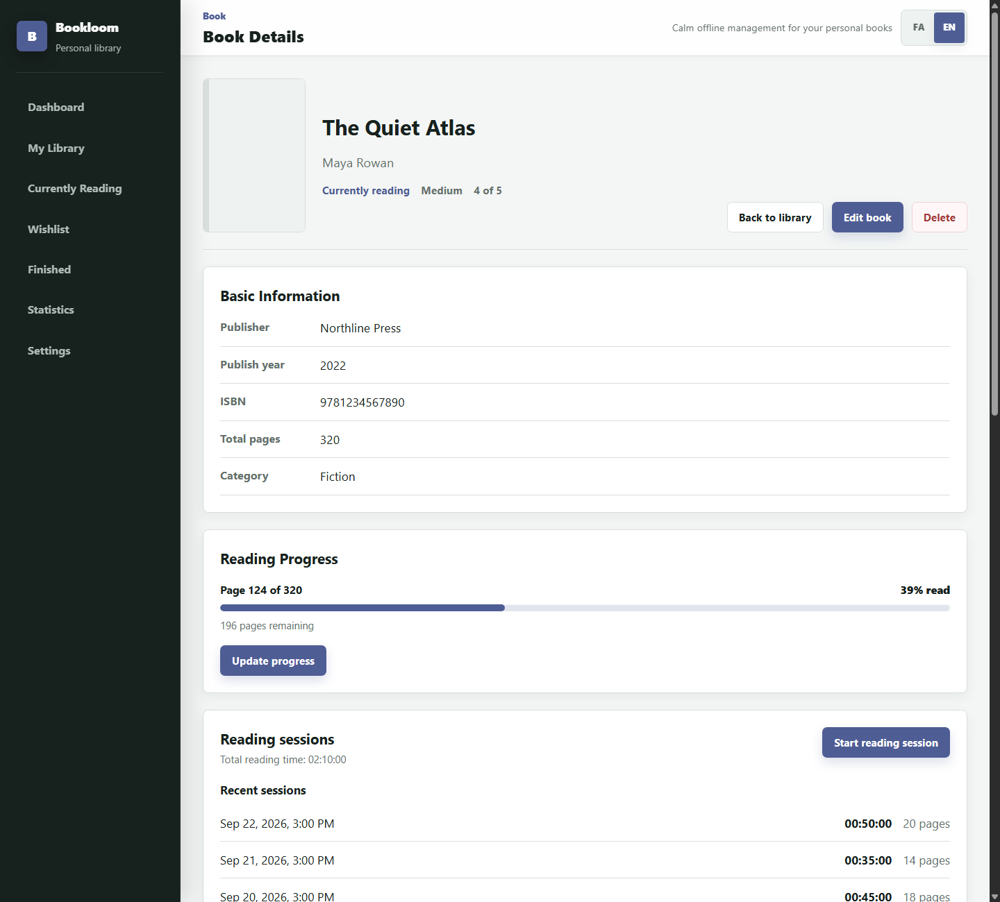
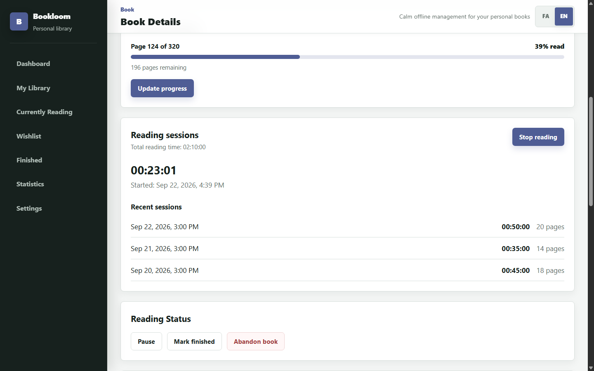

# Bookloom

A local-first personal library for organizing books, tracking reading sessions, and understanding reading habits.

## Overview

Bookloom is a responsive React application for managing a personal book collection. It combines manual entry with Open Library search, tracks progress and timed reading sessions, and turns saved book data into practical analytics. Books and settings stay in the browser's `localStorage`; no account or backend is required for everyday use.

## Live Demo

**Coming soon.** Add the deployment link here when Bookloom is hosted.

## Screenshots

The screenshots below use sample library data.

### Dashboard & Reading Analytics


Library totals, reading metrics, and the monthly finished-books chart.

### Online Book Search


Title search in the add-book form, showing results from Open Library.

### Book Details


Book metadata, reading progress, and recent sessions.

### Reading Session


An active timer restored from its saved start time.

## Features

- Add, edit, delete, search, filter, and sort books across wishlist, owned, reading, paused, finished, and abandoned states.
- Import book metadata from Open Library into the existing form, with manual entry always available.
- Track pages, status, ratings, notes, reviews, quotes, annual goals, and next-book recommendations.
- Time reading sessions, optionally log pages on stop, and review session history.
- Explore reading analytics and a Recharts monthly completion chart.
- Export a JSON backup, then replace or merge saved data during restore.
- Switch between English/LTR and Persian/RTL, themes, accent colors, and digit styles.

## Tech Stack

| Area | Technology |
| --- | --- |
| UI and routing | React 19, React Router, Vite |
| Charts | Recharts |
| Book discovery | Open Library Search API and Covers API |
| Persistence | Browser `localStorage`, JSON backup/restore |
| Testing | Vitest, React Testing Library, jsdom |
| Styling and quality | CSS, Oxlint |

## Architecture

- `src/pages` and `src/components` contain routed screens and reusable book/dashboard UI.
- `src/context` and `src/hooks/useBooks.js` own shared book state and persistence. Books are normalized before entering application state.
- `src/services/openLibrarySearch.js` converts API documents into form-ready book data; selecting a result does not save it.
- `src/utils` contains duplicate checks, progress/status rules, reading analytics, storage, and backup validation/merge logic.
- `src/i18n` provides English and Persian copy. The dashboard derives metrics from stored books and sessions rather than maintaining a second analytics store.

## Open Library Integration

The add-book form searches the Open Library Search API by title, author, or ISBN. Results show a cover when available, title, author, and publication year. Missing fields and covers are handled safely. Choosing a result prefills the editable form; the user reviews and saves it explicitly. Online search requires a network connection and sends the query to Open Library, while manual entry works without it.

## Duplicate-Book Protection

Before saving a new book, Bookloom compares normalized ISBNs. If an ISBN is missing, it falls back to normalized title and author. The same check covers manual entries and Open Library imports, shows a warning instead of silently discarding a book, and excludes the current record during edits.

## Reading Sessions and Timer

Books marked as currently reading can start and stop a session. Only one session can be active at a time. Its start timestamp is persisted, so the timer resumes correctly after refresh. Stopping records start time, end time, and duration; adding pages is optional and updates progress without exceeding a known page count. The book details page shows total logged time and recent sessions.

## Reading Analytics and Streaks

The dashboard reports books finished this month and year, estimated pages read from current book state, logged session time, average rating, favorite category, and current streak. The streak uses actual session start dates, including an active session, on local calendar days; a streak ending yesterday remains current. Recharts visualizes finished books by month for the current year. The standalone `/statistics` route is still a placeholder; these analytics live on the dashboard.

## Testing

Vitest and React Testing Library cover book add/edit/delete behavior, duplicates, progress and status transitions, timer persistence, analytics, Open Library success/error responses, and backup/restore logic. External search requests are mocked in tests.

```bash
npm run lint
npm run test:run
npm run build
```

Use `npm test` for watch mode while developing.

## Accessibility / RTL Support

Bookloom supports English LTR and Persian RTL layouts, responsive mobile and desktop views, visible form labels, and user-facing validation feedback. The monthly chart has an accessible label and a text summary of its data. Theme and digit-display preferences are available in Settings.

## Installation

Requires npm and Node.js `^20.19.0` or `>=22.12.0`.

```bash
npm ci
npm run dev
```

Open the URL printed by Vite (usually `http://localhost:5173/`). To preview a production build, run `npm run build` followed by `npm run preview`.

Data is local to the current browser and device. Export a backup from Settings before clearing browser storage or moving devices. There is no cloud sync or authentication.

## Challenges

- **Unpredictable API data:** Open Library records can omit authors, years, or covers, so search results are normalized before reaching the form.
- **Reliable sessions:** Persisting a start timestamp, rather than only an in-memory counter, lets the timer recover after refresh and supports one active session across the library.
- **Honest analytics:** Finished-book dates and session dates answer different questions; the dashboard keeps those calculations separate and handles empty libraries.

## What I Learned

- Normalize third-party and stored data at the boundary so UI components receive stable shapes.
- Keep derived statistics out of persistence when they can be recalculated from books and sessions.
- Treat backup/restore and focused tests as core parts of a local-first application, not afterthoughts.

## Roadmap

- Deploy a live demo and replace the placeholder above.
- Build out the dedicated `/statistics` page beyond the current dashboard analytics.
- Add end-to-end coverage for Settings restore rollback when browser storage fails.

No license has been specified for this repository yet.
