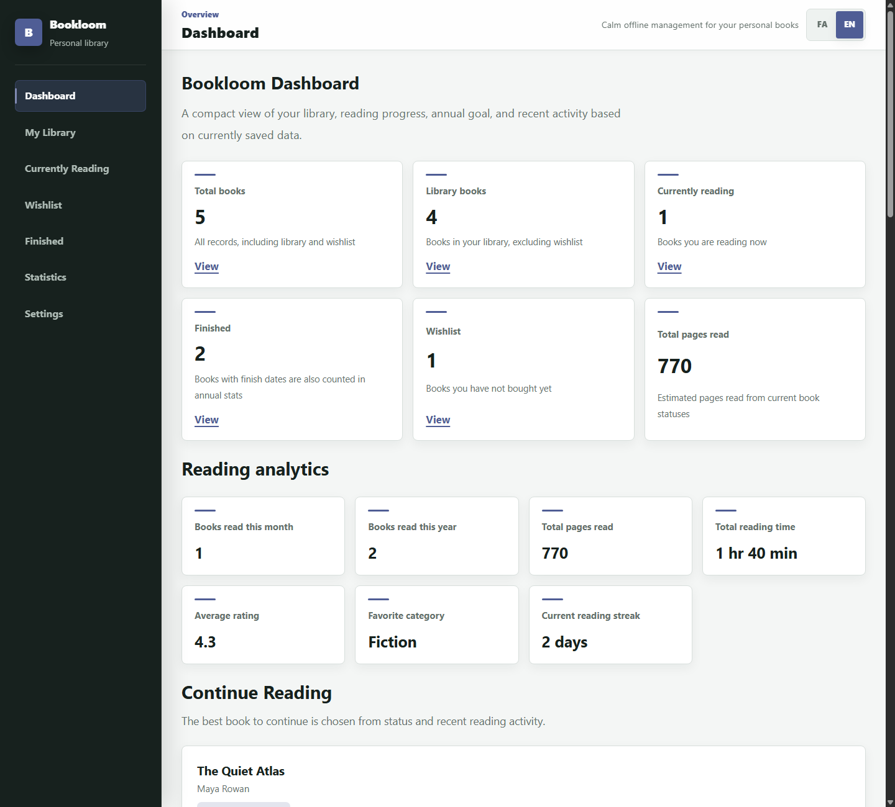
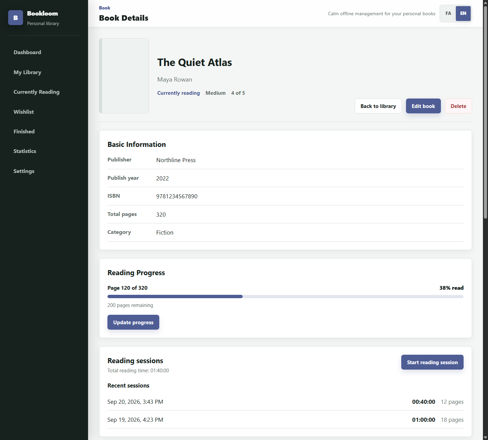

# Bookloom

A personal library for tracking books, reading progress, and the habits that grow around them. Bookloom is a local-first React app: everyday use requires no account or backend, and your library stays in your browser. The interface supports both English (LTR) and Persian (RTL).



> Screenshots use fictional sample data. No personal library data is included in this repository.

## Features

- **Organize your library:** Add, edit, and delete books; move them between wishlist, owned, reading, paused, finished, and abandoned states; search, filter, and sort your collection.
- **Add books your way:** Enter a book manually or search [Open Library](https://openlibrary.org/developers/api) by title, author, or ISBN. Selecting a search result prefills the existing form; it does not save the book until you confirm. Duplicate warnings check ISBN first, then normalized title and author when an ISBN is missing.
- **Track reading:** Record current page and progress, run one reading-session timer at a time, optionally add pages read when stopping, and review session history. An active session survives a page refresh.
- **Understand your reading:** See books finished this month and year, estimated pages read, logged reading time, average rating, favorite category, and a streak calculated from session dates. A monthly chart shows finished books across the current year.
- **Keep the details:** Save notes, quotes, reviews, and ratings; set an annual reading goal and get a local next-book recommendation.
- **Take your data with you:** Export a JSON backup, restore by replacing or merging data, and reset Bookloom data from Settings.
- **Make it yours:** Switch language, theme, accent color, start page, and Persian or Latin digits.



## Quick start

You need npm and Node.js `20.19+` or `22.12+`. From the project root:

```bash
npm ci
npm run dev
```

Open the local URL printed by Vite, usually `http://localhost:5173/`. If that port is busy, Vite will choose another one.

To build and preview the production version:

```bash
npm run build
npm run preview
```

## Commands

| Command | Purpose |
| --- | --- |
| `npm run dev` | Start the development server |
| `npm run lint` | Run Oxlint |
| `npm test` | Run Vitest in watch mode |
| `npm run test:run` | Run the test suite once |
| `npm run build` | Build the app into `dist/` |
| `npm run preview` | Preview the production build |

The test suite covers book CRUD, duplicate detection, progress and status transitions, reading-session persistence, analytics, Open Library responses, and backup validation and restore logic.

## Data and privacy

Bookloom stores data in `localStorage` on the current browser and device. Its main keys are `bookloom_books`, `bookloom_reading_goals`, and `bookloom_preferences`; `bookloom_collection_preferences` is retained for compatibility with older settings. Clearing browser data can erase your library, so export a JSON backup from **Settings** before switching devices or clearing storage.

Online search is optional. When you search, the query is sent to Open Library, and online cover images are loaded from Open Library's cover service. Manual entry works without it. Bookloom does not provide cloud sync or user accounts.

Backup files include books and their reading sessions, reading goals, and preferences. **Replace** swaps current Bookloom data for the backup. **Merge** combines books by ID and keeps the record with the newer `updatedAt` value when IDs match.

## Project layout

```text
src/
  components/   Book forms, shared UI, and dashboard sections
  pages/        Routed application pages
  hooks/        Book and reading-goal state
  context/      Shared books and preferences
  services/     Open Library search
  utils/        Normalization, analytics, validation, and backup logic
  i18n/         English and Persian copy
  styles/       Global and responsive styles
```

The main stack is React 19, React Router, Vite, Recharts, Vitest, React Testing Library, and plain CSS.

## Current scope

Bookloom is local-first, not a cross-device sync service. The standalone `/statistics` route is still a placeholder; working analytics and the monthly chart are on the dashboard. No license has been specified for this repository yet.
